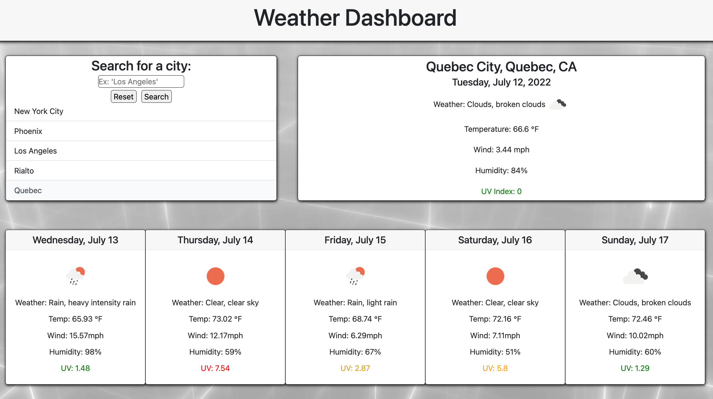

# Weather-Dashboard
An interactive weather dashboard powered by OpenWeather One Call API.

## Overview
The purpose of this project was to create an interactive dashboard that takes the user's input, and displays the current weather, along with a five day forecast, all powered by the [OpenWeather One Call API](https://openweathermap.org/api/one-call-api).

## How it works
The user simply inputs a city name into the search bar and clicks on the `search` button or hits their `enter` key. Then the page will update with the current weather, as well as the five day forecast for that specified city. 

The city is then added into `localStorage` as well as the recent searches section directly below the search bar. The page stores every previous search into `localStorage` and upon loading the page, will recreate the user's previous searches. The user can then click on any of the previous searches to regenerate its info to the page. The user can also hit the `reset` button to clear their data from `localStorage` and delete their list.

## What it looks like

## The live page
The live page can be found by clicking [here.](https://tonyq032.github.io/Weather-Dashboard/) 
